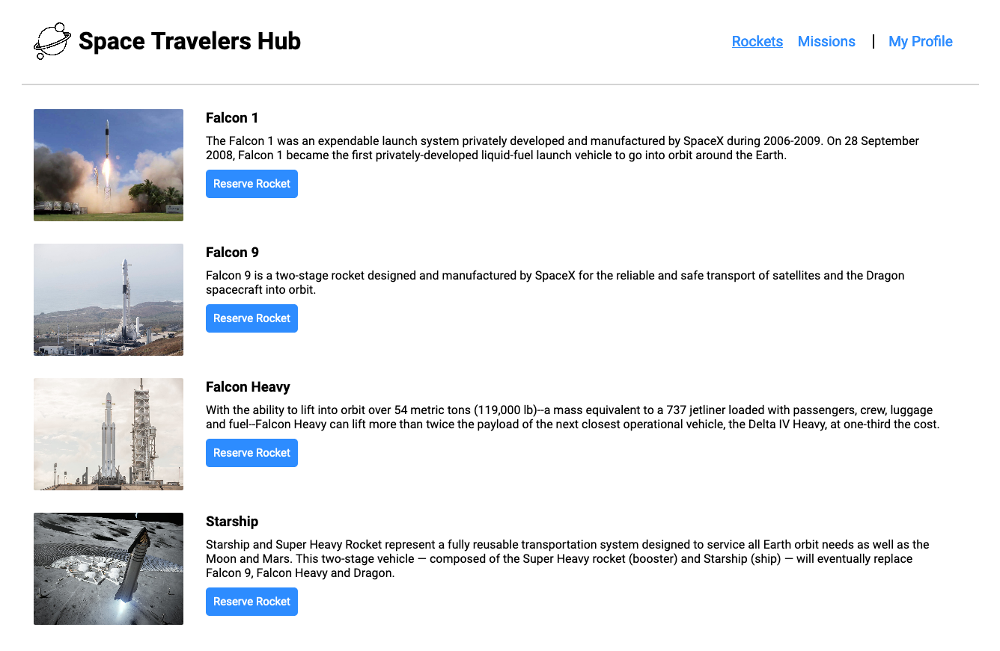

# Project Name

Space Travelers Hub

A web application for a company that provides commercial and scientific space travel services. The application will allow users to book rockets and join selected space missions.

## Built With

- 
- 
- 
- 
- 
- 

# Screenshots

## Live Demo

You can see my page live here:
[Check it out!](https://the-catalystmc.github.io/space-travelers-hub/)

## Getting Started

To get a local copy up and running follow these simple example steps. You can either download the zip file, or clone the repository from [here](https://github.com/the-catalystmc/space-travelers-hub). Once the repository is available locally you can use: `npm install` to install the packages `npm start` to run the server on local server.
To run tests `npm test` can be used.

## Authors

👤 **Rhyine Stewart**

- GitHub: [@the-catalyst-mc](https://github.com/the-catalyst-mc)
- Twitter: [@catalystspeaks](https://twitter.com/catalystspeaks)
- LinkedIn: [Rhyine Stewart](https://linkedin.com/in/rhyinestewart)

👤 **Kevin**

- GitHub: [@sevinchek](https://github.com/sevinchek)
- Twitter: [@sevinchek](https://twitter.com/sevinchek)
- LinkedIn: [LinkedIn](https://linkedin.com/in/sevinchek)

## 🤝 Contributing

Contributions, issues, and feature requests are welcome!

Feel free to check the [issues page](https://github.com/the-catalystmc/space-travelers-hub/issues).

## Show your support

Give a ⭐️ if you like this project!
